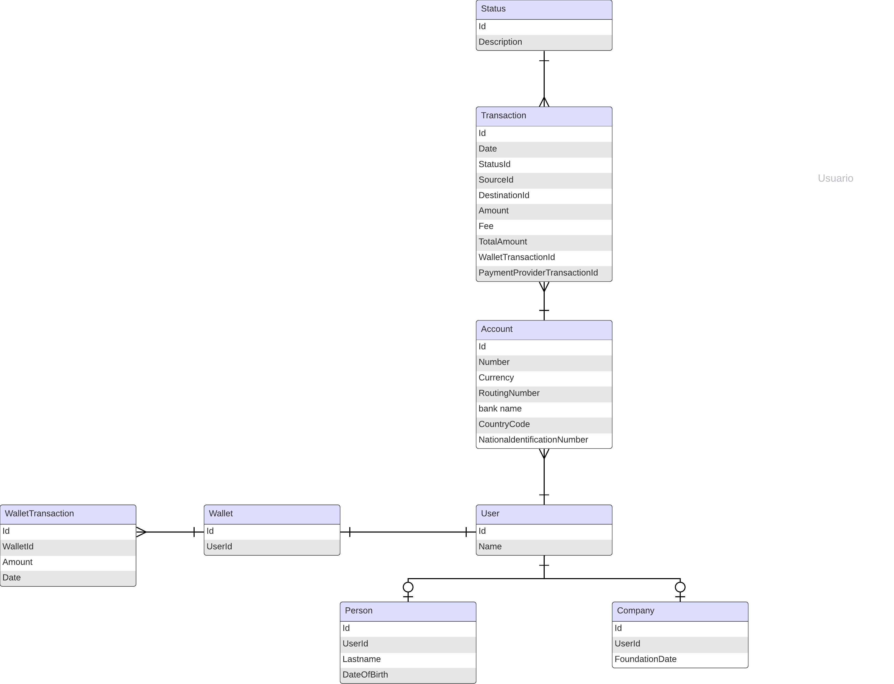
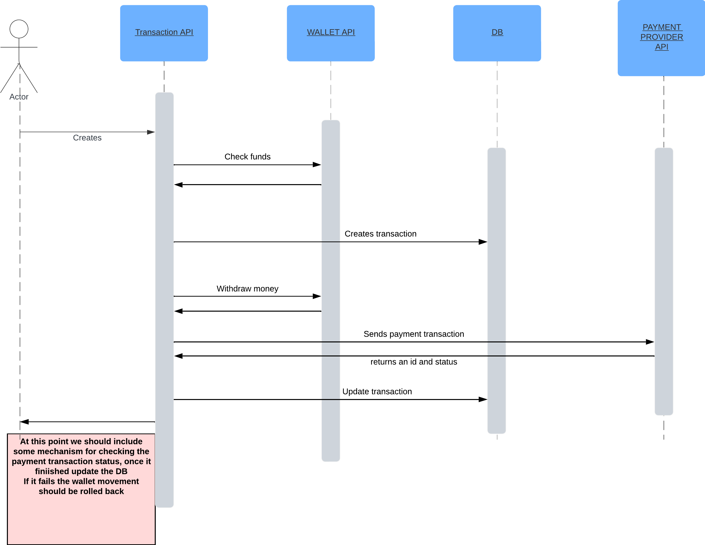

# ontop-interview


This code contains an springboot web API based in hexagonal architecture.

This API is used for creating customers transactions, saving it into an in memory DB and updating the wallet balance and the bank accounts.
Service startup will create DB and insert some users, accounts, etc. Please check data.sql file.

If this API is meant to be a microservice ONLY for transactions, maybe we don't want to store more entities in the DB, only the transactions with the FK of the rest of entities

Here is an image of the related entities.
Please note that the attributes are just examples, not final ones.



Note:
User can be a customer or a company (maybe not now, maybe for the future)
A user can have more than one destination account




## How to run

First run
```bash 
mvn clean install
```

```bash 
mvn spring-boot:run 
```

A postman collection is added to the repository for testing the endpoint


## To improve

There are some points for improvement

* Fee, default source account,URLs, etc. should be part of the configuration file
* Lot of testing is missing
* Mappers can be improved
* I used resttemplate for http request, I was out of time, maybe another client is nicer and better
* If this is going to work as a microservice only for transactions some tables can be dropped
* Naming conventions 
